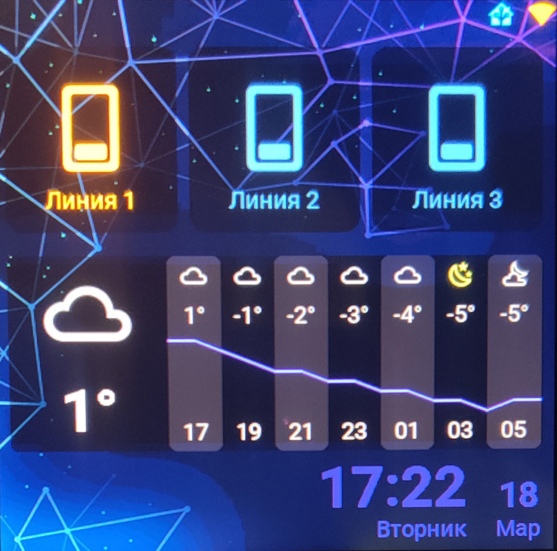
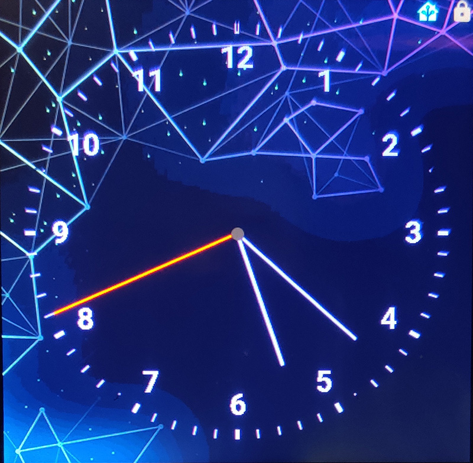

# Пример esphome скрипта для панели Gution ESP32-4848S040C

## Как использовать

Скопируйте содержимое каталога src в папку esphome, при необходимости переименуйте файл 
gution_4848.yaml

Отредактируйте содержимое файла. Все ключевые настройки содержутся в первых 20 строках

Переход на экран настроек происходит при нажатии на иконку в правом верхнем углу.
При длительном нажатии включается экран блокировки

