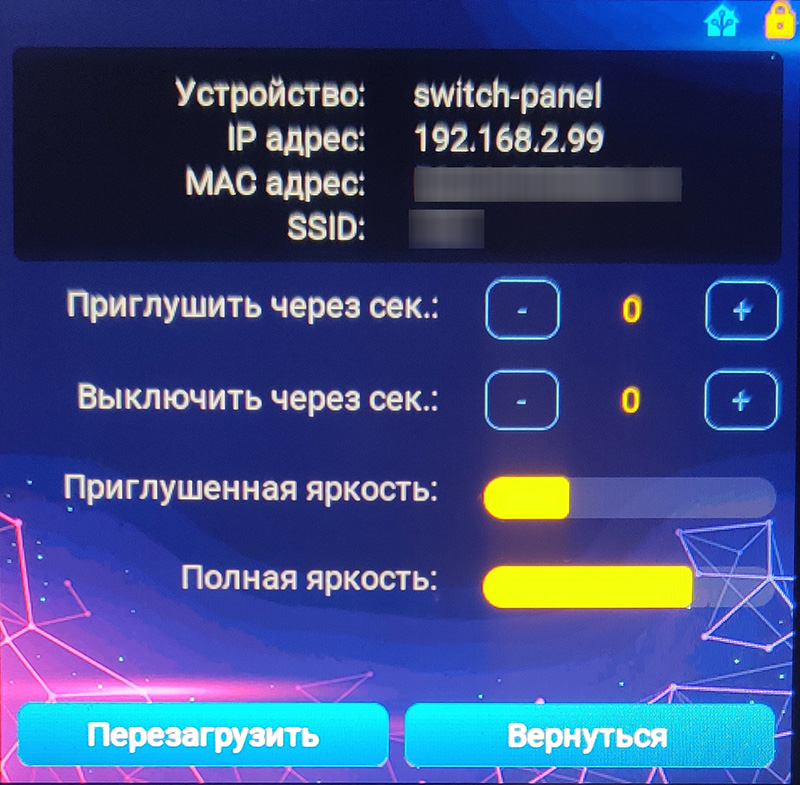

# Пример esphome скрипта для панели Gution ESP32-4848S040C

  

## Как использовать

Скопируйте содержимое каталога src в папеу esphome, при необходимости переименуйте файл 
gution_4848.yaml

Отрадактируйте содержимое файла. Все ключевые настройки содержутся в первых 20 строках

